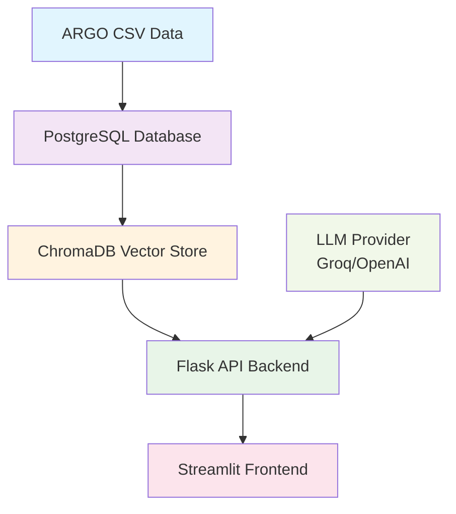

# 🌊 Floatchat - Oceanographic Data Chatbot

> **Intelligent conversational interface for ARGO float oceanographic data analysis**

Floatchat is a full-stack application that combines PostgreSQL, ChromaDB, and Large Language Models (LLMs) to enable natural language querying of ARGO float oceanographic datasets. Chat with your ocean data to discover temperature profiles, salinity patterns, and pressure measurements across the globe.

---

## 🎥 Demo

<!-- Add your demo video here -->
[

---


## 🚀 Features

✨ **Smart Data Loading**
- Bulk import ARGO float CSV datasets into PostgreSQL
- Efficient chunked processing for large datasets
- Automatic table creation and indexing

🧠 **AI-Powered Search**
- Vector embeddings using sentence-transformers
- ChromaDB integration for semantic search
- Support for Groq and OpenAI LLMs

💬 **Conversational Interface**
- Streamlit-powered chat UI
- Natural language queries like "Show me temperature profiles near 10°N 70°E"
- Real-time responses with data visualizations

📊 **Rich Data Analysis**
- Temperature, salinity, and pressure profile analysis
- Geographic and temporal data filtering
- Interactive charts and maps

🔧 **Production Ready**
- Flask REST API backend
- Modular architecture
- Environment-based configuration
- Docker support (coming soon)

---

## 🏗️ Architecture



---

## 🛠️ Tech Stack

**Backend:**
- 🐍 Python 3.8+
- 🗄️ PostgreSQL 16/17
- 🔍 ChromaDB for vector storage
- 🌐 Flask REST API
- 🤖 sentence-transformers for embeddings

**Frontend:**
- 🎨 Streamlit for UI
- 📊 Plotly for visualizations
- 🗺️ Folium for maps

**AI/ML:**
- 🧠 Groq/OpenAI LLM integration
- 🔤 all-MiniLM-L6-v2 embeddings
- 🔍 Semantic similarity search

---

## ⚡ Quick Start

### Prerequisites

- Python 3.8+
- PostgreSQL 16/17
- Git
- ARGO float dataset (CSV format)

### 🚀 Installation

#### 1️⃣ Clone the Repository

```bash
git clone https://github.com/your-username/argo-ai.git
cd argo-ai
```

#### 2️⃣ Backend Setup

```bash
cd backend
python -m venv venv

# Activate virtual environment
source venv/bin/activate   # Linux/Mac
# OR
venv\Scripts\activate      # Windows

pip install -r requirements.txt
```

#### 3️⃣ Database Configuration

Create PostgreSQL database:
```bash
createdb argo_ai_db
```

Update database credentials in:
- `backend/context.py`
- `backend/load_data.py`
- `backend/setup_chroma.py`
- `backend/chatbot.py`

Or create a `.env` file:
```env
DB_HOST=localhost
DB_PORT=5432
DB_NAME=argo_ai_db
DB_USER=your_username
DB_PASSWORD=your_password
GROQ_API_KEY=your_groq_api_key
OPENAI_API_KEY=your_openai_api_key
```

#### 4️⃣ Data Loading & Indexing

```bash
# Load ARGO CSV data into PostgreSQL
python load_data.py

# Create vector embeddings in ChromaDB
python setup_chroma.py
```

#### 5️⃣ Start Backend Server

```bash
python chatbot.py
```

Backend API will be available at `http://127.0.0.1:5000`

#### 6️⃣ Frontend Setup

Open a new terminal:

```bash
cd frontend
python -m venv venv

# Activate virtual environment
source venv/bin/activate   # Linux/Mac
# OR
venv\Scripts\activate      # Windows

pip install -r requirements.txt
```

#### 7️⃣ Launch Frontend

```bash
streamlit run app.py
```

Frontend will be available at `http://localhost:8501`

---

## 🔑 API Keys Setup

### For Groq (Recommended - Free tier available)

```bash
# Linux/Mac
export GROQ_API_KEY="your_groq_api_key_here"

# Windows PowerShell
$env:GROQ_API_KEY="your_groq_api_key_here"
```

### For OpenAI

```bash
# Linux/Mac
export OPENAI_API_KEY="your_openai_api_key_here"

# Windows PowerShell
$env:OPENAI_API_KEY="your_openai_api_key_here"
```


---

## 📁 Project Structure

```
argo-ai/
├── backend/
│   ├── venv/                 # Backend virtual environment
│   ├── chatbot.py           # Flask API server
│   ├── load_data.py         # Data loading script
│   ├── setup_chroma.py      # Vector embedding setup
│   ├── context.py           # Database configuration
│   └── requirements.txt     # Backend dependencies
├── frontend/
│   ├── venv/                # Frontend virtual environment
│   ├── app.py              # Streamlit application
│   └── requirements.txt    # Frontend dependencies
├── data/
│   └── argo_data.csv       # Your ARGO dataset
├── screenshots/            # Application screenshots
├── docs/                  # Additional documentation
└── README.md              # This file
```

---

## 🔧 Configuration

### Database Schema

The `argo_profiles` table structure:
```sql
CREATE TABLE argo_profiles (
    id SERIAL PRIMARY KEY,
    float_id INTEGER,
    cycle_number INTEGER,
    date_time TIMESTAMP,
    latitude REAL,
    longitude REAL,
    pressure REAL[],
    temperature REAL[],
    salinity REAL[],
    created_at TIMESTAMP DEFAULT NOW()
);
```

### Environment Variables

| Variable | Description | Required |
|----------|-------------|----------|
| `DB_HOST` | PostgreSQL host | Yes |
| `DB_PORT` | PostgreSQL port | Yes |
| `DB_NAME` | Database name | Yes |
| `DB_USER` | Database username | Yes |
| `DB_PASSWORD` | Database password | Yes |
| `GROQ_API_KEY` | Groq API key | Optional* |
| `OPENAI_API_KEY` | OpenAI API key | Optional* |

*At least one LLM provider key is required

---

### Manual Deployment

1. Set up PostgreSQL on your server
2. Configure environment variables
3. Run backend with gunicorn: `gunicorn -w 4 -b 0.0.0.0:5000 chatbot:app`
4. Run frontend with custom port: `streamlit run app.py --server.port 8501`

---

---

1. Install PostgreSQL (16/17 recommended).  
2. Create a database:  
   `createdb floatchat_db`  
3. Update DB credentials inside:  
   - backend/context.py  
   - backend/load_data.py  
   - backend/setup_chroma.py  
   - backend/chatbot.py  
   (or use a `.env` file with `python-dotenv`)  

4. Load ARGO CSV data into PostgreSQL:  
   `python backend/load_data.py`  

This script reads the CSV in chunks, creates the `argo_profiles` table if not exists, inserts profiles with JSON arrays (pressure, temperature, salinity), and builds indexes for performance.

---

## 🔎 ChromaDB Setup

After DB is populated, index profiles with embeddings:  
`python backend/setup_chroma.py`

This will pull profiles from PostgreSQL, encode them with `all-MiniLM-L6-v2`, and store vectors + metadata in ChromaDB.

---

## 🤖 Run the Chatbot Backend

Start the Flask chatbot service:  
`python backend/chatbot.py`

By default, it runs at `http://127.0.0.1:5000`.  


